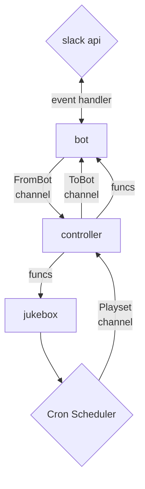

# Song of the day bot

This project is a Song of the Day Slack Bot that provides daily link from a 
list of songs to one or more channels.   The bot provides a separate 
playlist for each channel.   Channels that run out of their private list of
songs will backfill from songs that have been previously played in other
channels.

The playlist for each channel is randomized, allowing users to add many of
their favorite songs at one time without hogging the front of the playlist
queue. Prolific users are able to swamp out other users,  so it's 
advisable to encourage many users to participate!

## Usage

Interation with the bot primarily happens via private message. You can send
the following commands to the bot to control song of the day for your channel


### Bot commands
-------------------

This bot only listens for private messaages for security purposes. There is
also no need to invite Sotd into any channels for it to work, as it can 
post blindly into channels.


**add CHANNEL URL [OPTIONAL DESCRIPTION]**  - Add a song to a play with optional
description

**delete URL**  - Delete song matching URL

**playlists** - List all running playlists

**load CHANNEL URL**  - Import a json playlist from an URL.  Imports will be
credited to the importer (See Bulk Importing Songs, below)

**stop CHANNEL** - Tell SOTD to remove a playlist for a channel. The songs will be
saved for backfill, but the playlist will be gone, gone, gone

**show CHANNEL** - Show the playlist for a given channel

**hello** - Say hello


## Crontab

Each channel can be scheduled independently of one another. The pattern is a
stanadrd cron format (https://en.wikipedia.org/wiki/Cron) with numeric fields
for Minute, Hour, Day of Month, Month and Day of week (numeric, sunday being 0)


` 00 22 * * 1-5 ` - Play a song at 22:00 UTC (3PM PDT) Mon-Fri  to celebrate the deployment window
` 00 16 * * 1 ` -  Play a monday morning song every Monday for the SRE Livesite channel 

The main intent is for each channel to set the best time for SOTD for their own
channel playlist, but the functiality is there if you want to set your cron up
for certain months or days of the month too.  

## Bulk Importing Songs

Songs can be imported over HTTP/S via a json formatted list. The list should have
the following structure:

```
[
  {
    "URL": "https://www.youtube.com/watch?v=hQKfAdhXBpA"
    "Description": "Kids playing drums in new orleans"
  },
  {
    "URL": "https://www.youtube.com/watch?v=dQw4w9WgXcQ",
    "Description": "Would I be me without this one?"
  },
]
```

You can instruct the bot to import the bot to import this list to the playlist of your choice
by messaging it  `load #your_channel_name https://some.url/here.json`.  Imported songs will
be credited to you, so I'd suggest being thoughtful about introducting NSFW songs in your 
work environment.


## Installation

Sotd is able source its configuration from either Ini files or environment variables, depending upon
whether the deployment is intended for traditional installs or docker. Any configuration value specified
in the ini config may be set via the environment by setting a key of `SOTD_$section_$key="value"`.  For
example, one can turn on event streaming by  running export `SOTD_slack_debug=true` 

```

[slack]
# debug = true  # if you wish to see the bot event stream
botToken=xoxb-#############-#############-########################
appToken=xapp-#-###########-#############-################################################################
```

## Databases

Sotd supports both SQLite and MySQL which may be chosen by setting type under
[Database] to "sqlite" or "mysql" 

Sqlite
--------

The sqlite connector requires  single argument under the database section, the
path of the database. A temporary database can be created in memory by setting
a path of "file::memory:?cache=shared"

```
# Run an ephemeral version of sotd, perhaps for debugging. Playlists will be
# lost when the process dies!
[database]
type = "sqlite"
path = "file::memory:?cache=shared"
```

```
[database]
type = "sqlite"
# path = "file::memory:?cache=shared" # temporary in-memory db for testing
path = "/var/lib/sotdbot.db"
```

Mysql
------

The mysql connector requires 5 options;   host, port, user, pass and db.  

```
[database]
type = "mysql"
user = "username"
host = "mysql-server"
pass = "password"
db   = "database name"
```


Design
--------




## Dedication

This project is dedicated to my close friends Belmin, Brandon, Brian, Drew,
Jaysen, Jeff, Jeremy and Jhurani.  You guys mean the world to me and I 
literally can not wait for the day for our paths to cross again.  Come 
see me =)


